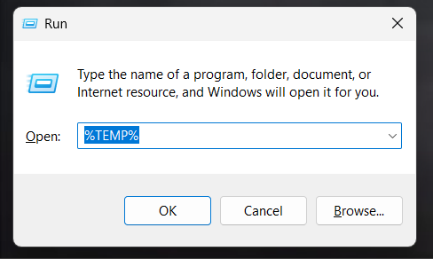
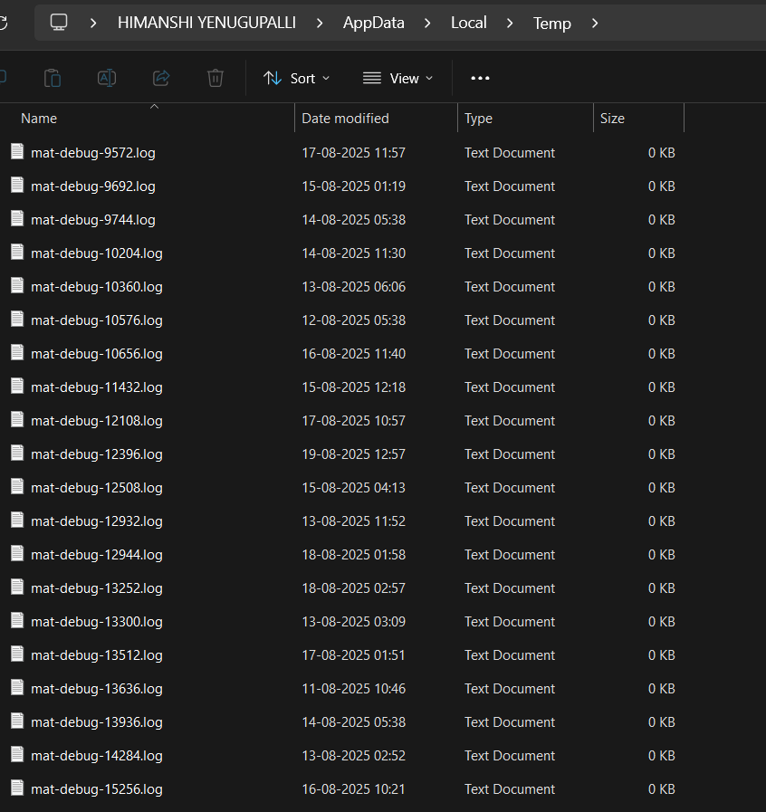
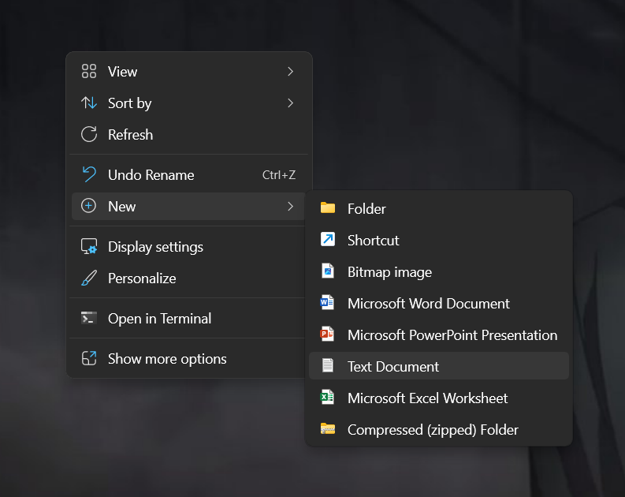
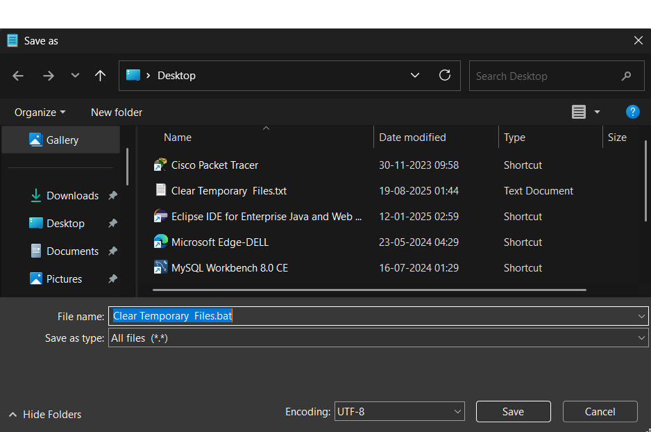

# Automatically Deleting Temporary Files with a Batch File

This guide explains how to delete temporary files using a batch file on Windows, and how to make it run automatically.

---

## 1. Check Temp Files

To view the temporary files, open the Run dialog (`Win + R`), type `%TEMP%`, and press Enter. You’ll see a folder containing temporary files. 


## 2. See Present Temp Files

Open the Temp folder by typing `%TEMP%` in the Run dialog (`Win + R`) and pressing Enter. You’ll see the existing temporary files.


## 3. Batch File on Desktop (Primary Method)

You can create a batch file that deletes temporary files.

### 3.1 Create Clear Temporary Files.txt and Write Code

1. Create a new text file named `Clear Temporary Files.txt` on your Desktop.  

2. Add the following script code:


```batch
@echo off 
echo Clearing Temporary Files...
del /q /f /s "%temp%\*"
for /d %%p in ("%temp%\*") do rd /s /q "%%p"
echo Temporary files cleared safely.
pause
```

3. Save the file as `ClearTemp.bat` by changing the file extension from `.txt` to `.bat` in the Save As dialog. Ensure the **Save as type** is set to **All Files (*.*)**.



### 3.2 How it works

- `del /q /f /s "%temp%\*"` → deletes all files in the Temp folder quietly and forcefully.  
- `for /d %%p in ("%temp%\*") do rd /s /q "%%p"` → deletes all subfolders in Temp.  
- `pause` → keeps the window open so you can see the result.

**Note:**  
If the batch file is on your Desktop, it **only runs when you double-click it manually**. It is **not automatic**.

---

## 4. Make It Automatic

You can make the batch file run automatically using any of these methods:

### 4.1 Startup Folder

1. Press `Win + R`, type `shell:startup`, and press Enter.  
2. Copy your batch file into this folder.  
3. The batch file will run automatically every time you log in to Windows.

### 4.2 Task Scheduler

1. Press `Win + S`, type `Task Scheduler`, and open it.  
2. Click **Create Basic Task…**  
3. Give it a name (e.g., “Clear Temp Files”) → **Next**.  
4. Choose a trigger (e.g., **Daily**) → **Next**.  
5. Set the time → **Next**.  
6. Choose **Start a program** → **Next**.  
7. Browse and select your batch file → **Next** → **Finish**.  

> The batch file will now run automatically on the schedule you set.

### 4.3 Registry Run Key

> ⚠️ Be careful when editing the registry.

1. Press `Win + R`, type `regedit`, and press Enter.  
2. Navigate to:

```
HKEY_CURRENT_USER\Software\Microsoft\Windows\CurrentVersion\Run
```

3. Right-click → **New → String Value**  
4. Name it `ClearTempFiles`  
5. Set the value to the **full path of your batch file**, e.g.:

```
"C:\Users\YourName\Desktop\ClearTemp.bat"
```

> The batch file will run automatically every time you log in.

---

**Tip:**  
Remove the `pause` line from the batch file if you want it to run silently without showing the console window.

